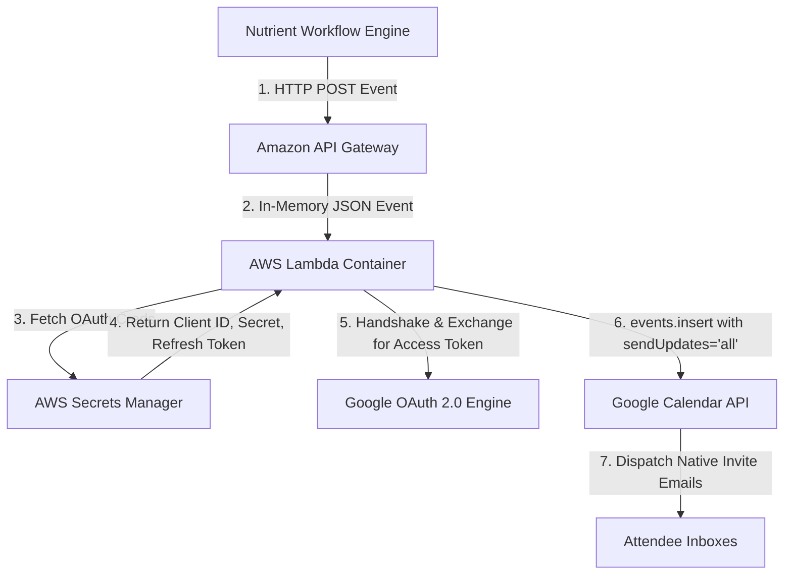

# Technical Reference Manual: Herbert Calendar Webhook Scheduler

Welcome to the technical reference manual for the **Herbert Calendar Webhook Scheduler**. This document provides a high-level explanation of the system's architecture, dependencies, and deployment process, designed as an educational guide for engineering interns and onboarding developers.

---

## 🗺️ 1. Architecture & Core Functionality

The application is a **serverless webhook receiver** that automatically schedules meetings and dispatches native Google Calendar email invitations when triggered by workflow automation tools (such as Nutrient).

### System Flow


### Core Functionality
* **Dynamic Time Slot Processing:** The application parses incoming meeting parameters: attendees (list of emails), date (`YYYY-MM-DD`), start time (`HH:MM`), duration, location, and description. It supports two modes:
  1. **Single Slot:** Processes a single meeting using the top-level `date` and `start_time`.
  2. **Multiple Suggested Slots:** If the payload contains a `suggested_times` array, the function loops through it and schedules a separate calendar event for each suggested slot.
* **No-Credential Storage (Runtime Injection):** Instead of storing Google API credential files (`credentials.json` or `token.json`) locally or inside the Docker container, the code retrieves them dynamically from **AWS Secrets Manager** at runtime.
* **Official Google Invitations:** By using `sendUpdates='all'` in the Google Calendar API call, the calendar owner's account issues official meeting invites with `.ics` attachments directly to the attendees' email inboxes.

---

## 🛠️ 2. AWS Lambda Container & SAM CLI Deploys

Traditional serverless deployments upload raw zip code files. For this project, we package the Lambda function inside a **Docker Container Image** and manage the deployment with the **AWS Serverless Application Model (SAM)**.

### How it was Built & Configured
1. **Containerization (`Dockerfile`):**
   * Uses the official AWS-managed base image `public.ecr.aws/lambda/python:3.11`.
   * Installs Python packages into the runtime-managed `${LAMBDA_TASK_ROOT}` directory.
   * Copies the application code modules without any local credentials, keeping the image entirely secure and credential-free.
2. **Infrastructure-as-Code (`template.yaml`):**
   * Declares the AWS resources in a YAML configuration file.
   * Defines an `AWS::Serverless::Function` with `PackageType: Image`.
   * Configures a POST endpoint path `/schedule` mapping to an Amazon API Gateway REST API.
   * Attaches an IAM execution policy allowing the function to call `secretsmanager:GetSecretValue` on our specific Cloud Secret.
3. **The Deployment Pipeline (SAM CLI):**
   * **`sam validate`** checks the syntax and format of the YAML file.
   * **`sam build`** invokes the local Docker engine to compile the container image, installing dependencies and preparing the environment.
   * **`sam deploy`** automates the AWS setup: it creates an Amazon ECR (Elastic Container Registry) repository, uploads the Docker image, spins up the IAM roles, registers the secret parameter, provisions the Lambda function, and exposes the public API Gateway URL.

---

## 📦 3. Dependencies & Libraries

The application uses a small, targeted list of dependencies defined in `requirements.txt`:

* **`boto3`:** The official Amazon Web Services (AWS) SDK for Python. Used to query AWS Secrets Manager for Google OAuth credentials.
* **`google-api-python-client`:** The official library used to query Google APIs (in our case, the Google Calendar API v3 service).
* **`google-auth` & `google-auth-oauthlib`:** Libraries dedicated to managing Google's OAuth 2.0 flows. They take the permanent `refresh_token`, perform the handshake, and fetch a short-lived `access_token` automatically behind the scenes.
* **`google-auth-httplib2`:** An authentication helper required for transport security.

---

## 💻 4. Running & Testing Guide

You can test this project in two distinct environments: **locally** on a command line or **live** against the deployed cloud instance.

### A. Local Command Line Testing
To run the code locally, **no complex compilers are needed**. You only need a standard Python runtime environment. 

1. **Virtual Environment (`.venv`):** 
   You initialize an isolated Python virtual environment using `python -m venv .venv`. This acts as a sandbox, installing packages locally inside the project folder so that you do not pollute your global OS environment.
2. **Local Environment Variables:**
   Instead of connecting to AWS Secrets Manager locally, the helper file `secrets_manager.py` checks for a `LOCAL_DEV=true` flag. If true, it retrieves the OAuth credentials from local terminal environment variables.
3. **Running the Harness:**
   We wrote a CLI harness (`local_test.py`) that accepts parameters directly. To test without any external tools:
   ```powershell
   python local_test.py --attendees intern@example.com --date 2026-07-20 --time 14:00 --duration 30 --location "Google Meet" --description "Quick Sync"
   ```

### B. Testing the Deployed API Endpoint
Once deployed to AWS, the endpoint is a public-facing URL. To test it:

1. **No compilers or CLI tools are required** to make requests to the live endpoint.
2. You can use standard client applications like **Postman**, **Insomnia**, or a simple command-line HTTP utility like **`curl`** or PowerShell's **`Invoke-RestMethod`**.
3. **Example Request:**
   Send an **HTTP POST** request to the endpoint URL:
   `https://91e5h88jv0.execute-api.us-east-1.amazonaws.com/Prod/schedule`

   *Headers:*
   `Content-Type: application/json`

   *Body (JSON):*
   ```json
   {
     "attendees": ["test.member@example.com"],
     "date": "2026-07-20",
     "start_time": "15:00",
     "duration_minutes": 60,
     "location": "Conference Room A",
     "description": "Onboarding alignment meeting"
   }
   ```
4. **Response:**
   The function will return a status code `200` with the created Google Calendar Event ID and an invite URL link.
